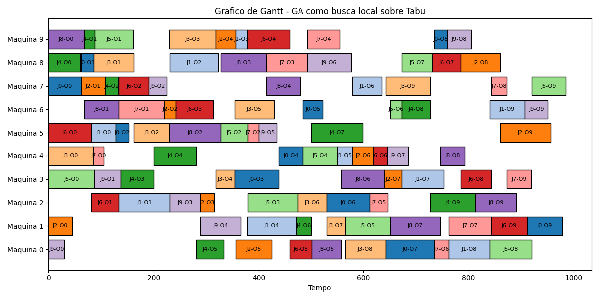

# Busca Tabu Híbrida com Algoritmo Genético para Job Shop Scheduling

Este projeto implementa um algoritmo genético combinado com Busca Tabu para resolver problemas de escalonamento em ambientes de produção (Job Shop Scheduling). O objetivo é encontrar a sequência de operações que minimize o **makespan** (tempo total de conclusão).

## Funcionamento do Algoritmo

### Componentes Principais  
- **Busca Tabu**: Exploração global inicial com prevenção de ciclos  
- **Algoritmo Genético**: Refinamento local via evolução populacional  
- **Paralelismo**: Aceleração massiva na avaliação de soluções  
- **Gráfico de Gantt**: Representação visual do cronograma ótimo  

### Fluxo Principal de Execução
1. **Geração Inicial**  
   - Cria uma solução válida aleatória (`gerar_individuo()`)
   - Exemplo: Sequência de operações que respeita a ordem dos jobs

2. **Busca Tabu (Fase Global)**  
   - Refina a solução inicial através de:
     - 300 iterações de busca em vizinhança
     - Movimentos proibidos armazenados por 15 iterações
     - Aceitação estratégica de soluções piores

3. **Algoritmo Genético (Fase Local)**  
   - Aplica 30 gerações de evolução com:
     - População de 10 indivíduos baseada na melhor solução Tabu
     - Taxa de mutação efetiva de 50%
     - Seleção por torneio entre top 5 soluções 

## Parâmetros de Configuração
| Parâmetro           | Valor Padrão      | Descrição                                      |
|---------------------|-------------------|------------------------------------------------|
| `Gerações (GA)`     | 30                | Número de iterações do Algoritmo Genético      |
| `TAM_POPULAÇÃO`     | 10                | Quantidade de soluções por geração             |
| `TAXA_MUTACAO`      | 0.5 (50%)         | Probabilidade de mutação em cada solução       |
| `ITERACOES_TABU`    | 300               | Máximo de iterações da Busca Tabu              |
| `TAMANHO_TABU`      | 15                | Número máximo de movimentos proibidos          |

**Explicação dos Parâmetros:**
1. **Gerações (GA)**: Controla o número de ciclos evolutivos do algoritmo genético (`geracoes=30` em `ga_local()`)
2. **TAM_POPULAÇÃO**: Define o tamanho da população em cada geração do GA (`tam_pop=10`)
3. **TAXA_MUTACAO**: Probabilidade de aplicar mutação durante o crossover (`if random.random() < 0.5` no GA)
4. **ITERACOES_TABU**: Número máximo de iterações na fase de Busca Tabu (`max_iteracoes=300`)
5. **TAMANHO_TABU**: Capacidade da lista tabu para evitar ciclos (`tamanho_tabu=15`)

## Instruções de Uso

### Formato da Entrada
Número_de_jobs Número_de_máquinas  
Job_0: Máquina1 Duração1 Máquina2 Duração2 ...
Job_1: Máquina1 Duração1 Máquina2 Duração2 ...
...

**Exemplo para instância ABZ6 (10x10):**
Adams, and Zawack 10x10 instance (Table 1, instance 6)  
10 10  
7 62 8 24 5 25 3 84 4 47 6 38 2 82 0 93 9 24 1 66  
5 47 2 97 8 92 9 22 1 93 4 29 7 56 3 80 0 78 6 67  
1 45 7 46 6 22 2 26 9 38 0 69 4 40 3 33 8 75 5 96  
4 85 8 76 5 68 9 88 3 36 6 75 2 56 1 35 0 77 7 85  
8 60 9 20 7 25 3 63 4 81 0 52 1 30 5 98 6 54 2 86  
3 87 9 73 5 51 2 95 4 65 1 86 6 22 8 58 0 80 7 65  
5 81 2 53 7 57 6 71 9 81 0 43 4 26 8 54 3 58 1 69  
4 20 6 86 5 21 8 79 9 62 2 34 0 27 1 81 7 30 3 46  
9 68 6 66 5 98 8 86 7 66 0 56 3 82 1 95 4 47 2 78  
0 30 3 50 7 34 2 58 1 77 5 34 8 84 4 40 9 46 6 44  

### Execução  
python GA+TS+MP.py  
Siga as instruções no terminal para inserir os dados.  

### Saída Gerada
1. **resultado_final.txt**:  
   - Sequência ótima de operações em formato `(Job, Operação)`
   - Makespan final e tempo de execução
   - Cronograma detalhado por máquina

2. **grafico_gantt_final.png**:  
   Gráfico de Gantt mostrando a alocação temporal das operações nas máquinas.

## Otimizações Chave
 - Controle de Validade: Garante soluções viáveis durante operações genéticas
 - Estratégia de Vizinhança: Gera movimentos válidos na Busca Tabu
 - Elitismo: Preserva as melhores soluções entre gerações
 - Processamento Eficiente: Calcula makespan em O(n) para cada solução

## Vantagens da Abordagem
 - Tabu como Global: Escape eficiente de ótimos locais
 - GA como Local: Exploração direcionada de áreas promissoras
 - Sinergia: Combina velocidade da Tabu com precisão do GA

## Referências
1. Eiben, Á. E., Hinterding, R., & Michalewicz, Z. (1999). Parameter Control in Evolutionary Algorithms. IEEE Transactions on Evolutionary Computation.  
2. Gao, J., Sun, L., & Gen, M. (2007). A hybrid genetic algorithm for the job shop scheduling problem. Computers & Operations Research.  
3. Gao, J., Sun, L., & Gen, M. (2008). An effective genetic algorithm for the flexible job-shop scheduling problem. Computers & Industrial Engineering.  
4. Glover, F., & Laguna, M. (1997). Tabu Search.  
5. Goldberg, D. E. (1989). Genetic Algorithms in Search, Optimization, and Machine Learning.  
6. Gonçalves, J. F., & Resende, M. G. C. (2005). A hybrid genetic algorithm for the job shop scheduling problem. European Journal of Operational Research.  
7. Mitchell, M. (1998). An Introduction to Genetic Algorithms. MIT Press.  
8. Python Multiprocessing Documentation. Python Software Foundation.  
9. Vaghefinezhad, S., & Wong, K. Y. (2012). A Genetic Algorithm Approach for Solving a Flexible Job Shop Scheduling Problem.  
